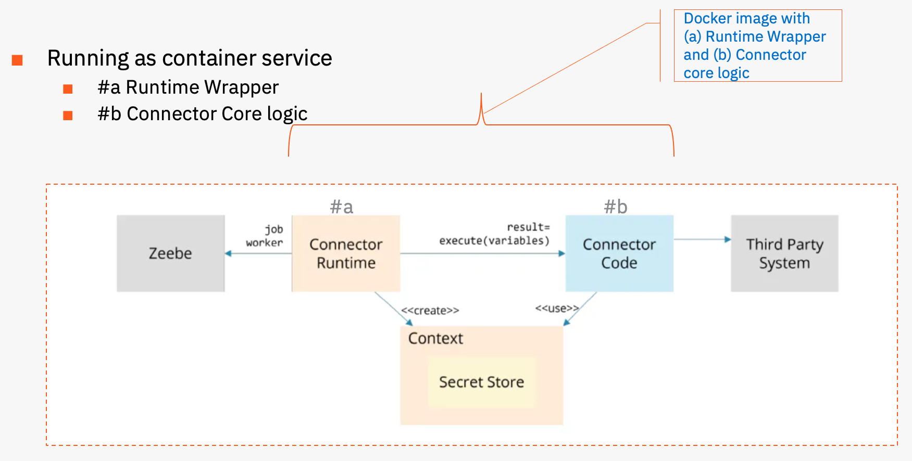

# redis-connector-nodejs
Redis connector to perform outbound integration from your Camunda 8 platform. Supports JSON data format and standard operations. See below.

## Operations supported
Standard CRUD operations - GET, PUT and DELETE.
> 
Note: Put operation supports both creating a new record as well as updating existing record.


## Redis version
Connector operations are tested against below Redis instance running on Google Cloud.
> 
> redis_version:7.2.0
>
> redis_mode:standalone
> 
> os:Linux 5.4.0-1064-gcp x86_64
> 
> gcc_version:7.5.0


## Code Quality
Quality gate checks successfully executed leveraging Sonar Cloud. 
> 
Click on <code>link</code> below to see detailed report.
> 
[](https://sonarcloud.io/summary/new_code?id=rchari-ml_redis-connector-nodejs)

## How to run unit / integration test cases?
Open VS Code. 
Clone the repository.
Make sure you have access to Redis database.

Open terminal and run below two commands.
> 
> npm run build
> yarn jest --coverage (or npm test)
>
> Note a: Make sure to export env variables to connect with your Redis instance.
>
> 
> export REDIS_HOSTNAME=your-db-name-here.redislabs.com
> 
> export REDIS_PORT=11485
> 
> export REDIS_USER=user-name
> 
> export REDIS_SECRET=a-valid-pwd-for-your-env
> 
> export REDIS_SECRET_DUMMY=ask-me-for-this
> 
> Note b: The dummy secret <code>REDIS_SECRET_DUMMY</code> is used for running negative test case (connection error simulation).
> 

## I want to practice somethig simple first. How can I do that?
If you are new to Connector SDK, then I recommend you to try the weather-api sample so you are familiar with NodeJS connector wrapper, configuration points and how the nuts & bolts essentially work.
> 
The steps are outlined here: 
> ```
> https://github.com/camunda-community-hub/camunda-8-connector-openweather-api
> ```


## How to run redis connector using Docker?

The docker image consists of two parts, as shown in the design diagram.

The first part (#a) is runtime wrapper that handles interaction with Zeebe, registration and associated handshake. Refer to code base here: https://github.com/rchari-ml/redis-connector-runtime

The second part (#b) is the core logic of the Redis Connector. This is represented in the current code base. (redis-connector-nodejs)

In order to run the Redis Connector, please follow instructions in the link for part #a.





# Common Issues
Zeebe configuration and Redis configuration are the most common mistakes. Make sure spelling mistakes are avoided.
>
Ensure connector secret <code>secrets.REDIS_SECRET</code> is defined in your Camunda 8 environment.


# References
The redis-connector-nodejs code base has been built on the SDK defined here.
> 
https://github.com/camunda-community-hub/connector-sdk-nodejs


# Contact for Support
If you need any assistance, we are just an email away - contact@makelabs.in
